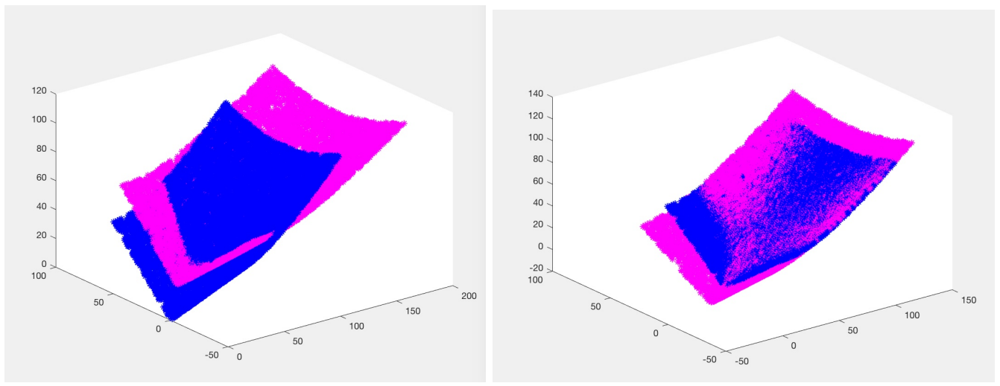

# ЗАМЕТКИ ОБ АЛГОРИТМЕ ИТЕРАЦИОННОГО БЛИЖАЙШЕГО СОСЕДА

**Прохазкова Яна (Чехия), Мартишек Далибор (Чехия)**

## Аннотация

Облака точек широко используются в различных технических областях. Сегодня они применяются в автономных автомобилях, 3D-моделировании объектов и рельефа. Во время сканирования устройство или объект могут перемещаться, из-за чего возникает проблема точной регистрации облаков точек. В данной статье описан алгоритм итерационного ближайшего соседа (ICP), подходящий для точной регистрации. Также представлены улучшения, повышающие точность, вычислительную скорость и эффективность. Алгоритм ICP протестирован на зашумлённых облаках точек.

**Ключевые слова:** алгоритм итерационного ближайшего соседа, облако точек, метод наименьших квадратов  
**Классификация по математике:** Primary 65D18; Secondary 68U05

## 1. Введение

В настоящее время наблюдается значительный рост применения облаков точек в большом количестве технических дисциплин. Наиболее значимые применения включают использование технологий 3D-сканирования для описания окружающей среды (дороги, городские районы, леса и т.д.). Сегодня мы можем видеть прогресс технологий сканирования и обработки в области автономных транспортных средств [20]. Для этих целей часто используется технология LiDAR (Light Detection and Ranging, [3] [12]). Это метод съёмки, который измеряет расстояние до цели, освещая её импульсным лазерным светом и измеряя отражённый импульс с помощью датчика. В инженерных приложениях широко применяются оптические 3D-сканеры. Результатом обоих принципов сканирования является облако точек, которое можно описать как набор точек данных в некоторой системе координат, обычно определяемой координатами x, y, z.

Когда сенсорное устройство или сканируемый объект перемещается, результирующее облако точек частично перекрывается. Основная задача — собрать эти частичные сканы вместе для формирования конечного объекта. Этот процесс обычно называется регистрацией точек.

Согласно [4], мы можем разделить процесс регистрации на две основные части: грубое и точное совмещение. В части грубого совмещения мы находим соответствующие точки с помощью детекторов и/или дескрипторов. Существует огромное количество методов детекторов и дескрипторов, например, Maximally Stable Volumes [14], MeshDoG, Intrinsic Shape Signatures [22], Point Signature descriptor [9] и Spin Image [10]. Эта часть определяет грубое совмещение сканов. В нашей статье мы имеем дело со второй частью — точным совмещением, которое точно выравнивает эти два облака точек. Наиболее мощный алгоритм Iterative Closest Points представлен в разделе 2, а результаты подробно описаны в разделе 3.

![Рис. 1. Регистрация облака точек, источник [4].](image.png)

В нашей статье мы представляем алгоритм итерационного ближайшего соседа (ICP), который является одним из часто используемых алгоритмов на практике. Алгоритм был впервые описан в [8], [1]. Основа алгоритма заключается в поиске оптимального отображения, состоящего из трансляции и поворота, которое минимизирует расстояние между соответствующими точками в смысле наименьших квадратов.

Авторы в [1] сформулировали проблему как:
"Дано 3D-данные в системе координат датчика, которые описывают форму данных, которая может соответствовать модельной форме, и дано модельную форму в системе координат модели в другом представлении геометрической формы, оценить оптимальный поворот и трансляцию, которые выравнивают или регистрируют модельную форму и форму данных, минимизируя расстояние между формами и тем самым позволяя определить эквивалентность форм через метрику среднеквадратичного расстояния."

## 2. Алгоритм ICP

### 2.1 Теоретические основы

В этом разделе мы кратко описываем математические основы алгоритма ICP. Более подробно см., например, [2]. Этот алгоритм очень популярен из-за своей простоты и ясности. Однако базовый алгоритм работает только в идеальных случаях, что приводит к его дальнейшим модификациям и улучшениям, которые будут описаны в 2.3.

В общем случае пусть M, S — два конечных множества в конечномерном действительном векторном пространстве R^d, содержащие M и N точек соответственно. Мы хотим определить жёсткое или нежёсткое преобразование T : R^d → R^d, которое минимизирует расстояние между данными множествами:

$$dist_g(T(M),\:S) =\sum_{m \in T(M)}\sum_{s \in S}g((m - s)²)\;(1)$$

Также можно использовать среднеквадратичное расстояние (RMSD) для сравнения T(M) и S:

$$RMSD(T(M), S) = \frac{\sum_{m \in T(M)}\sum_{s \in S}|m - s|²}{n}\;(2)$$

В случае, когда множества M, S содержат выбросы, то есть точки, которых нет в обоих множествах, мы можем вычислить только частичное перекрытие. В этих случаях подходящим является установка порогового параметра thr, который устраняет ошибки. Для множества пар точек C = (m_i, s_j), где m_i ∈ M, s_j ∈ S должно выполняться:

$$\forall s_k \in S : dist(m_i, s_k) ≥ dist(m_i, s_j), dist(m_i, s_j) < thr\;(3)$$

Уравнение (2) может быть записано как:

$$RMSD(T(M), μ(S)) = \frac{∑_C dist(m_i, T(s_j))^2}{|C|}),\;m_i, s_j \in C\;(4)$$

где расстояние $T(m_j)$ и $s_i$ минимально, а $|C|$ — мощность множества $C$.

### 2.2 Обзор ICP

Пусть S и M — входные облака точек, где исходное облако точек S, а M — модельное облако точек. Мы ищем жёсткое преобразование, которое удовлетворяет наилучшему соответствию между данными облаками точек. Следующие шаги описывают алгоритм ICP:

1. вычислить ближайшую точку в множестве S для каждой точки (части точек) в множестве M, используя, например, евклидово расстояние:

   $$d_i = min\{\sqrt{m_i^2 - s_j^2}\}\;\;j = 1, ..., N_S\;(5)$$

2. если расстояние $d_i > threshold$, удалить данную пару точек

3. добавить веса к парам точек: неявно $w_{ij} = 1$, мы можем установить веса в зависимости от направления векторов нормали как их скалярное произведение:

   $$w_{ij} = n_i · n_j\;(6)$$

4. вычислить матрицу поворота R и вектор трансляции t, используя метод наименьших квадратов для минимизации расстояния, который описан в уравнениях (9)-(13)

5. вычислить преобразование множества S, используя вычисленные значения — $Rs_j + t$

6. вычислить ошибку $E(R, t)$, используя уравнение (7), итерировать до достижения требуемой точности.

Псевдокод алгоритма ICP:

```
AlgorithmICP (M, S)
θ := θ₀
while not registered:
    X := ∅
    for m_i ∈ T(M, θ)
        ŝ_j := closest point in S to m_i
        X := X + ⟨m_i, ŝ_j⟩
    θ = least squares(X) using SVD
return θ
```

В псевдокоде символ $\theta$ означает матрицу поворота $R$ и вектор трансляции $t$. Начальные значения $θ₀$: единичная матрица $R$ и нулевой вектор трансляции $t$. Множество $X$ содержит все пары, которые покрывают ближайшие точки в множестве $S$ к точкам в множестве $M$.

На следующем шаге мы вычисляем новое преобразование $θ = (R, t)$, используя SVD и уравнения (9)-(13). Затем преобразование θ применяется к модельным точкам M, и вычисляется ошибка. Мы итерируем эту установку до требуемой точности.

### 2.2.1 Математическое описание ICP

Пусть M, S — конечные множества с N_M и N_S точками. Сначала мы вычисляем ближайшую точку в множестве S для каждой точки в множестве M. Можно использовать все точки или выбрать точки случайным образом. Алгоритм ICP предполагает, что соответствующие точки являются ближайшими. Для этих пар мы вычисляем матрицу поворота и трансляцию. Мы пытаемся минимизировать ошибку:

$$E(R, t) = \sum_{i=1}^{N_M}\sum_{j=1}^{N_S}\omega_{ij} ||m_i-(Rs_j + t)||^2\;(7)$$


где $w_{ij}$ — веса для соответствующих точек. Если точка $m_i$ является ближайшей точкой к $d_j$, мы устанавливаем веса как $w_{ij} = 1$, иначе вес равен нулю.

Уравнение 7 может быть переписано как:

$$E(R,t) \propto \frac{1}{N}\sum_{i=1}^{N}||m_i - (Rs_j+t)||^2 \; (8)$$
где $\displaystyle N = \sum_{i=1}^{N_M}\sum_{j=1}^{N_S}\omega_{ij}$

и соответствующая матрица $w_{ij}$ заменяется суммой соответствующих точек.

Шаг оптимизации (найти (R, t)) основан на сингулярном разложении (SVD). Для вычисления SVD нам нужно центроидное выравнивание. Мы вычисляем центроиды обоих множеств точек как:

$$C_M = \frac{1}{N}\sum_{i=1}^{N}m_i$$
$$C_N = \frac{1}{N}\sum_{i=1}^{N}s_i$$


Впоследствии мы выравниваем все точки M, S, используя соответствующий центроид, и получаем:

$$M' = \{m'_i = m_i - C_M\}_{1,\dots,N}$$
$$S' = \{s'_i = s_i - C_S\}_{1,\dots,N}$$

Для этих значений легко вычислить ковариационную матрицу $H = M'S'ᵀ$ и выполнить SVD как:

$$H = UΛVᵀ\;(11)$$

Матрица поворота задаётся:

$$R = VUᵀ\;(12)$$

а вектор трансляции может быть вычислен как:

$$t = C_S - RC_M\;(13)$$

Первая итерация состоит из преобразования облаков точек, используя матрицу поворота R и вектор трансляции t. Впоследствии мы вычисляем ошибку, и если ошибка больше заданного порога, итерация продолжается.

### 2.3 Методы улучшения ICP

Предыдущий раздел описывает основные шаги и теоретические основы алгоритма ICP. Тем не менее, существует множество улучшений, которые пытаются обеспечить лучшую сходимость и улучшить время вычислений. Обзор можно найти, например, в [17] подробно. В этой части мы показываем некоторые возможные способы оптимизации алгоритма ICP.

**k-d дерево** K-d деревья являются особым случаем деревьев разделения двоичного пространства, которые часто используются как подходящая структура во многих приложениях, таких как поиски, включающие многомерный ключ поиска (например, поиски в диапазоне и поиски ближайших соседей). Вычисления алгоритма ICP могут быть эффективно ускорены с его использованием. Авторы [11] заявляют, что использование k-d дерева может улучшить скорость регистрации в 10 раз.

**Соответствующие точки** Оригинальная работа [1] работает со всеми точками в обоих облаках точек. Были сделаны определённые улучшения в использовании равномерной подвыборки данных точек и случайной выборки [13]. Проблема возникает в случае шума или форм с высокой кривизной, где эти методы не выбирают достаточно опорных точек (см. рисунок 2, слева). Решением является использование нормалей для выборки [6]. Обнаружение соответствующих точек с использованием нормалей показано на рисунке 2 справа.

![Рис. 2. Случайная выборка (слева) и выборка с нормалями (справа), источник [17]](image-1.png)

**Сопоставление точек** Алгоритм [1] основан на вычислении евклидова расстояния между точками. Однако это приводит к значительным вычислительным требованиям, в худшем случае алгоритм имеет временную сложность порядка O(N_M N_S), а средняя временная сложность равна O(N_M log N_S). Использование сортировки точек в kd-дереве приводит к временной сложности, равной O(log N).

Существует множество методов для ускорения вычисления расстояний. Работа [18] охватывает большинство возможностей методов сопоставления точек. Нормальный метод [8] основан на минимизации расстояния не только двух точек, но и приближённого расстояния точки от плоскости. Это вычисление уменьшает количество итераций, но метод не столь надёжен.

Другая группа методов основана на проекции точек из исходного облака (модели) на второе облако. Центр проекции может быть задан как положение камеры, которая сканирует, или в общем случае. Затем вы можете выбрать точку пересечения или работать с двумя точками в зависимости от расстояния или интенсивности [19] или цвета [16]. Также возможно использовать расстояние Хаусдорфа, как в [5], которая изучает некоторые теоретические результаты, используя расстояние Хаусдорфа в ICP.

Также возможно использовать особую точку SIFT как соответствующую точку в процессе улучшенного алгоритма ICP для уменьшения ошибки соответствующих точек. Уменьшение поиска ближайших точек улучшает точность и эффективность алгоритма ICP, как описывают авторы в [21].

**Взвешивание точек** Тривиальное взвешивание заключается в том, что каждая точка имеет одинаковый вес. Однако более подходящим является использование расстояния точек как меры пригодности. В зависимости от расстояния точек мы можем либо полностью исключить пару, если она превышает предопределённый порог, либо добавить вес к паре согласно формуле [7]:

$$Weight = 1 - \frac{dist(P₁P₂)}{dist_{max}}\;(14)$$

Мы также можем назначать веса в зависимости от направления векторов нормали. Если они параллельны в обеих точках, скалярное произведение является большим числом. С увеличением размера угла-нормали мы получаем меньшее скалярное произведение (перпендикулярные векторы имеют скалярное произведение, равное нулю). Назначение веса может выполняться как:

$$Weight = n₁ \cdot n₂\;(15)$$

**Соответствие между точками** Облака точек часто содержат шумовые точки и выбросы. Чтобы избежать неправильного выравнивания сканов, добавляются критерии для устранения или, по крайней мере, уменьшения этой проблемы. Обычная рекомендация — удалить пары точек, которые содержат точки на границах, если одна из поверхностей превышает другую (рис. 3).

Другой вариант — удалить точки, которые имеют расстояние больше заданного порога, удалить определённый процент точек в зависимости от метрики или удалить точки, расстояние которых больше заданного кратного стандартного отклонения расстояния.

![Рис. 3. Устранение перекрывающихся пар, источник [17].](image-2.png)

## 3. Результаты

Мы тестировали алгоритм на модельном облаке точек в программном обеспечении Matlab версии 2017b [15]. Мы генерировали облака точек со случайными наборами, а также добавляли шум. Тестируемые облака точек имеют 3 размера: 1000, 10 000 и 25 000 точек. Затем мы применили наш алгоритм ICP в Matlab. На рис. 4 мы можем видеть начальное положение входных облаков точек и зарегистрированное положение после применения алгоритма ICP. Время вычислений и количество итераций приведены в таблице 3.

| Количество точек | Количество итераций | Время (с) |
|------------------|---------------------|-----------|
| 1000            | 22                  | 1,552     |
| 10 000          | 32                  | 6,348     |
| 25 000          | 35                  | 22,502    |

Табл. 1. Регистрация облака точек на тестовых облаках точек.



Реализация в Matlab состоит из шагов, описанных в 2.2. Matlab является подходящим инструментом для программирования ICP из-за простоты использования матриц. Мы также можем использовать реализованные функции, такие как svd, pdist (евклидово расстояние) и т.д. В реализации мы можем выбрать метрики расстояния (евклидова, нормальная), порог для отклонения шумовых точек, тип взвешивания. Сравнение различных параметров затруднительно. Это зависит от типа облаков точек — их размера, шума, области перекрытия и формы. У нас также есть различные требования к результату, мы можем предпочесть скорость вычислений, точность или надёжность. Например, использование нормального вычисления расстояния увеличивает точность, но также снижает надёжность. Только использование хранилища k-d дерева строго рекомендуется. Оно может ускорить вычисления более чем в 10 раз. Другие параметры являются необязательными и зависят от входных облаков точек и будущего использования результатов.

## 4. Заключение

Алгоритм итерационного ближайшего соседа является основным методом регистрации облаков точек. Он используется для точного совмещения для обеспечения наилучших результатов. Мы представили обзор этого метода, а также описали возможные улучшения алгоритма. Мы протестировали базовый алгоритм на данных. В будущей работе мы хотели бы реализовать возможные улучшения и сравнить результаты.

## Благодарности

Эта работа была поддержана проектом LO1202 финансовыми средствами от Министерства образования, молодёжи и спорта в рамках Национальной программы устойчивости I.

## Список литературы

[1] BESL, P. J., MCKAY, N.D.: A Method for Registration of 3-D Shapes. IEEE Transactions on Pattern Analysis and Machine Intelligence. 14 (2) (1992), 239–256.

[2] JIAN, B., VEMURI, B. C.: Robust Point Set Registration Using Gaussian Mixture Models. IEEE Transactions on Pattern Analysis and Machine Intelligence. 33(8), (2011), 1633–1645.

[3] CRACKNELL, A. P.: HAYES, L.:Introduction to Remote Sensing (2 ed.) London: Taylor and Francis. (2007).

[4] DIEZ, Y., ROURE, F., LLADO, X., SALVI J.: A Qualitative Review on 3D Coarse Registration Methods. ACM Comput. Surv. 47, 3, (2015), 54:1-45:36.

[5] EZRA, E., SHARIR, M., EFRAT, A.: On the performance of the ICP algorithm, Computational Geometry, vol. 41, 1–2, (2008), 77-93

[6] GELFAND, N., IKEMOTO, L., RUSINKIEWICZ, S. LEVOY, M.: Geometrically stable sampling for the ICP algorithm, in Proceedings of the 4th International Conference on 3-D Digital Imaging and Modeling, Banff, Canada, (2003) 260–67.

[7] GODIN, G. RIOUX, M. BARIBEAU, R.: Three-dimensional Registration Using Range and Intensity Information. Proc. SPIE: Videometrics III, vol. 2350, (1994), 279-290.

[8] CHEN, Y., MEDIONI, G.: Object modelling by registration of multiple range images. Image Vision Comput. (1992), 145–155.

[9] CHUA, C.S., JARVIS, R.: Point Signatures: A New Representation for 3D Object Recognition. International J. Computer Vision 25, 1, (1997), 63–85

[10] JOHNSON, A.E.: Spin-Images: A Representation for 3-D Surface Matching, (1997), Carnegie Mellon University Pittsburgh, Pennsylvania, Ph.D. thesis.

[11] LI, S., WANG, J., LIANG, Z., SU, L.: Tree point clouds registration using an improved ICP algorithm based on kd-tree. In Proceedings of 2016 IEEE International Geoscience and Remote Sensing Symposium (IGARSS). 4545-4548.

[12] National Oceanic and Atmospheric Administration (NOAA) Coastal Services Center. Lidar 101: An Introduction to Lidar Technology, Data, and Applications. Revised. Charleston, SC: NOAA Coastal Services Center, (2012)

[13] TAKESHI, M.: Generation of geometric model by registration and integration of multiple range images. In Proceedings of the IEEE International Conference on 3D Digital Imaging and Modelling. (2001), 254–261.

[14] MATAS, J., CHUM, O., URBAN, M., PAJDLA, T. : Robust wide baseline stereo from maximally stable extremal regions. Proc. of British Machine Vision Conference, (2002), 384-396.

[15] Matlab software, Math Works, https://www.mathworks.com/products/matlab.html

[16] PULLI, K.: Surface Reconstruction and Display from Range and Color Data, (1997), University of Washington, Ph.D. thesis.

[17] RUSINKIEWICZ, S. LEVOY, M.: Efficient variants of the ICP algorithm. In Proceedings of the IEEE International Conference on 3D Digital Imaging and Modeling, (2001), 145–152.

[18] WANG, F., ZHAO, Z.: A survey of iterative closest point algorithm, In Procceding of Chinese Automation Congress (CAC), Jinan, China, (2017), 4395-4399.

[19] WEIK, S.: Registration of 3-D Partial Surface Models Using Luminance and Depth Information, In Proceeding of International Conference on Recent Advances in 3D Digital Imaging and Modeling, (1997), 93-100.

[20] ZHENG, Z., LI, Y.: LIDAR Data Registration for Unmanned Ground Vehicle Based on Improved ICP Algorithm. In Proceedings of 7th International Conference on Intelligent Human-Machine Systems and Cybernetics, Vol. 2 (2015), 554-558.

[21] ZHENG, Z., LI, Y., JUN, W.: LiDAR point cloud registration based on improved ICP method and SIFT feature, In Proceeding o IEEE International Conference on Progress in Informatics and Computing (PIC), Nanjing, (2015), 588-592.

[22] ZHONG, Y.: Intrinsic Shape Signatures: A Shape Descriptor for 3D Object Recognition, IEEE, 12th International Conference on Computer Vision Workshops, ICCV Workshops, (2009), 689-696.

## Текущий адрес

**Прохазкова Яна, Mgr. Ph.D.**  
Институт материаловедения и инженерии  
Центр NETME  
Брненский технологический университет  
Technická 2896/2 616 69 Брно, Чешская Республика  
E-mail: prochazkova.j@fme.vutbr.cz

**Мартишек Далибор, doc., PaedDr.**  
Институт материаловедения и инженерии  
Центр NETME  
Брненский технологический университет  
Technická 2896/2 616 69 Брно, Чешская Республика  
E-mail: martisek@fme.vutbr.cz